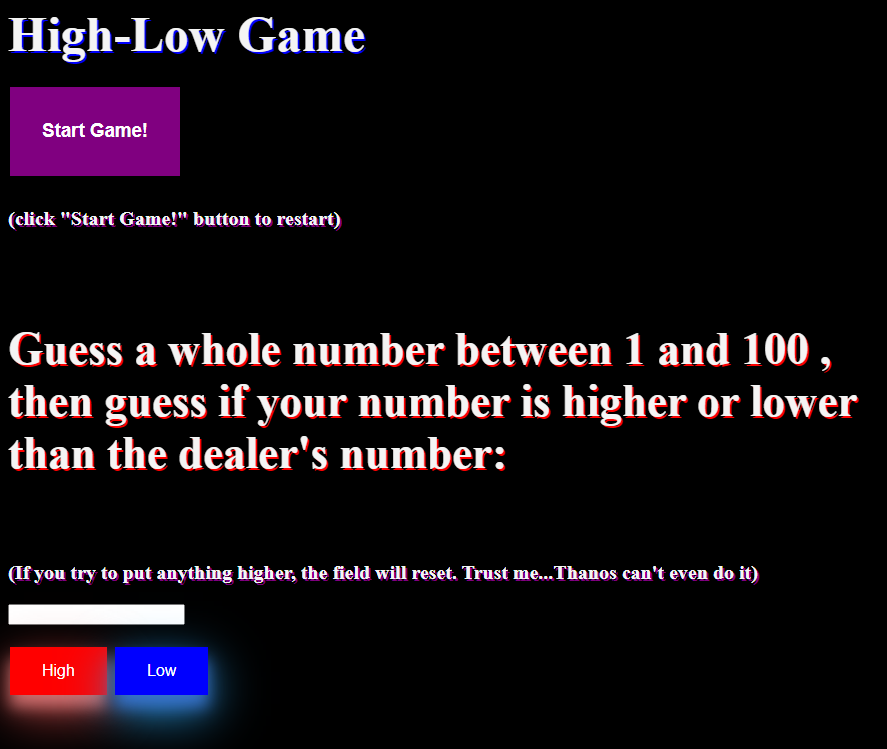
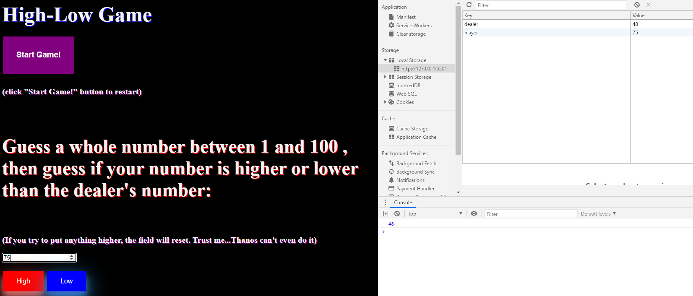

# High-Low Game


## About
The High-Low Game is a simple web application (using HTML5, CSS, and JS - no js frameworks were used) that involves a player versus the computer, or the "Dealer". The Dealer chooses a number between 1 and 100 (unbeknownst to the player). The user then chooses their own number between 1 and 100. After choosing their own number, the player then guesses if their number is either higher or lower than the Dealer's number. After the winner or loser is decided, the Dealer's number will be revealed. 


## Installation

To run the High-Low Game easily, you should have access to an IDE, I used VS Code and installed the Live Server extension within the IDE. However, it is possible to run the game locally without a server. If you choose to download VS Code, here is the link to get started:


[VSCode - https://code.visualstudio.com/download ](https://code.visualstudio.com/download)


## Objectives for the Web Application
- Demonstrate use of localStorage
- Field validation
- Random Number Generation
- DOM event usage

## Game View



## Usage
Here is a snippet of the function executed when the user clicks on the "High Button" and the player has selected a number
```script
function playerHighChoice() {//High Button
  localStorage.getItem("player", pNum)
  localStorage.getItem("dealer", dealer)
  if (pNum > dealer) {
    document.getElementById("Win").innerHTML = "<h1>YOU WON!!! LEEETTTSSS GOOOOOOO  :D</h1>";
  } else if (pNum < dealer) {
    document.getElementById("Lost").innerHTML = "<h2>YOU LOST!! BOO HOO MCGOO :(</h2>";
  }
}
```

## Special Thanks
I would like to give a special thanks to Jae Johns. Found this cool animation that I thought would go well with the rest of my CSS. 


[CSS Animation - https://medium.com/@jaejohns/9-incredibly-gorgeous-text-animations-in-css-f856cd20f81c](https://medium.com/@jaejohns/9-incredibly-gorgeous-text-animations-in-css-f856cd20f81c)


## Contributing
Pull requests are welcome. For major changes, please open an issue first to discuss what you would like to change.

Please make sure to update tests as appropriate.

## Experience
I am an up and coming web developer. This is my first public project published on GitHub.
I was interested in learning about localStorage, events, and the DOM. I thought this game would demonstrate some of those features. 